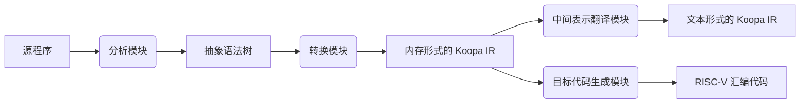

# 编译原理课程实践报告：我的编译器

## 一、编译器概述

### 1.1 基本功能

本编译器基本具备如下功能：
1. 源程序的词法和语法分析, 转换为内存形式的 Koopa IR.
2. Koopa IR 的内存形式到文本形式的翻译.
3. 基于Koopa IR 的内存形式生成 RISC-V 汇编代码, 在生成的同时完成目标代码的优化.

### 1.2 主要特点

我开发的编译器的主要特点是**功能完整**、**多级输出**、**同步优化**
- 功能完整: 实现了所有的基本功能，包括词法分析、语法分析、语义分析、中间代码生成、目标代码生成、优化等.
- 多级输出: 支持将内存形式的 Koopa IR 翻译成文本形式和基于 Koopa IR 生成 RISC-V 汇编代码.
- 同步优化: 在生成目标代码的同时完成了目标代码的优化.

## 二、编译器设计



### 2.1 主要模块组成

编译器主要由以下四个模块组成:
- 分析模块: 分析源程序, 构造抽象语法树, 实现在 `ast.rs` 和 `sysy.lalrpop` 中.
- 转换模块: 将抽象语法树转转换为内存形式的 Koopa IR, 实现在 `/mem` 目录下.
- 中间表示翻译模块: 将 Koopa IR 由内存形式翻译为文本形式, 实现在 `/ir` 目录下.
- 目标代码生成模块: 基于内存形式的 Koopa IR 生成 RISC-V 汇编代码, 同时完成代码的优化, 实现在 `/asm` 目录下.

### 2.2 主要数据结构

#### 2.2.1 抽象语法树

设计基于已有的 EBNF 文法, 在此不再赘述.

#### 2.2.2 符号表

在我的设计中, 符号表的功能主要有:

记录符号与变量和函数之间的映射关系, 用于语义分析和代码生成. 在这里选择使用 `HashMap` 来维护映射关系, 使用 `Vec` 模拟栈来处理嵌套作用域. 如下所示:

```rust
pub Scope<'ast> {
    values: Vec<HashMap<&'ast str, Entry>>,
    funcs: HashMap<&'ast str, Function>,
}
```

在抽象语法树到中间表示的转换过程中, 传递必要的程序信息, 包括当前程序点, 循环信息, 数组信息等. 如下所示:

```rust
pub Scope<'ast> {
    cur_func: Option<Function>,
    cur_bb: Option<BasicBlock>,

    loop_info: Vec<(BasicBlock, BasicBlock)>,
    array_info: Vec<usize>,
}
```

管理全局资源的分配, 如寄存器, 标志等. 在实现中, 我为每种资源都设计了分配器, 这些分配器都集成在符号表中. 如下所示:

```rust
pub Scope<'ast> {
   registers: Registers,
   label: Label,
}
```

### 2.2.3 活跃信息表

在我的设计中, 在抽象语法树到中间表示的翻译过程中记录下值的活跃区间, 得到中间表示上的活跃信息表. 活跃信息表维护一个计数器, 为每个值维护 `birth` 和 `death`. 在一个值被创造时, 将计数器的值赋给 `birth` 和 `death`, 以此来标记该值在指令序列中的位置. 每当该值被使用时, 将其对应的 `death` 修改为当前计数器的值. 活跃信息表实现如下:

```rust
pub struct ValueInfo {
    pub birth: usize,
    pub death: usize,
}

pub struct Info {
    counter: usize,
    value_infos: HashMap<Value, ValueInfo>,
    zero_array_infos: HashMap<Value, Vec<usize>>,
}
```

### 2.2.4 寄存器分配器

在我的设计中, 为了维护寄存器的使用情况, 实现了一个简单的寄存器分配器. 除了基本的分配功能外, 还实现了记录寄存器分配时间(`stamp`), 钉住寄存器(`fixed`)等功能. 寄存器分配器实现如下:

```rust
pub struct Register {
    pub name: String,
    pub used: bool,
    pub fixed: bool,
    pub stamp: usize,
    pub value: Option<Value>,
}

pub struct Registers {
    pub registers: Vec<Register>,
}
```

### 2.3 主要设计考虑及算法选择

#### 2.3.1 符号表的设计考虑

在我的设计中, 除分析之外的每个模块都有自己的符号表, 用来存储必要的程序信息, 在这里我以转换模块的符号表为例

```rust
pub struct Scope<'ast> {
    values: Vec<HashMap<&'ast str, Entry>>,
    funcs: HashMap<&'ast str, Function>,

    cur_func: Option<Function>,
    cur_bb: Option<BasicBlock>,

    loop_info: Vec<(BasicBlock, BasicBlock)>,
    array_info: Vec<usize>,

    label: Label,
}
```

在设计中主要考虑了以下几点:
- 保存必要的程序信息, 如当前的函数、当前的基本块、当前的循环等.
- 管理程序的资源, 如寄存器、标志等.
- 关于嵌套作用域的处理, 采用了栈的方式, 在进入和退出作用域时入栈和出栈, 在查询时从栈顶向栈底查找.

#### 2.3.2 寄存器分配策略

在寄存器分配上, 按照 "先到先得" 的原则, 使用尽可能多的寄存器.

每当申请寄存器时, 扫描所有可用寄存器, 如果有空闲的寄存器, 则分配该寄存器. 否则选择一个寄存器, 将其中的值溢出到栈上, 并将该寄存器分配给新的值.

在粗粒度, 即中间表示指令级别, 按照活跃信息表中的信息, 当一个值离开其活跃区间时, 释放其对应的寄存器. 在细粒度, 即目标代码指令级别, 采用启发式策略, 尽可能少地使用寄存器, 并在中间表示中的一条指令完成后, 释放所有不保存值仅保存中间结果的寄存器.

当离开一个基本块时, 所有寄存器中的值都会被溢出到栈上, 以避免在控制流中引发错误.

#### 2.3.3 采用的优化策略

主要的优化在于寄存器分配, 这使得目标代码的效率得到了极大的提高.

除此之外, 我还做了如下几点优化:
- 常量传播: 任何可以计算出值的表达式都会被计算出的常量替代.
- store-load 优化: 在 store 之后立即 load 的情况下, 去掉 load, 并将 store 的值直接传递给后续的指令.

#### 2.3.4 其它补充设计考虑

考虑到不同模块之间的独立性, 不同模块之间只使用 Koopa IR 的内存形式传递程序信息. 只在目标代码优化时额外传递了活跃信息表.

## 三、编译器实现

### 3.1 各阶段编码细节

#### Lv1. main函数和Lv2. 初试目标代码生成

在这部分的实现中, 我完成了整个编译器模块的设计, 将整个编译器分为了分析, 转换, 翻译和生成四个模块.

#### Lv3. 表达式

这一部分要求基本实现所有与表达式有关的结构, 实现难度并不大, 但在 `Rust` 实现中, 要注意使用 `Box` 来避免无限递归.

#### Lv4. 常量和变量

这一部分要求实现基本的符号表, 我的 `Scope` 不仅维护符号与变量和函数之间的映射关系, 还记录和传递了程序信息.

#### Lv5. 语句块和作用域

在这部分, 只要能正确地认识嵌套作用域, 实现上的难度并不大.

#### Lv6. if语句

在这部分, 我感觉二义性的问题并不是最困扰的, 由于从这时候开始, 我的编译器才注意到控制流的实现, 因此处理各种跳转和标识更令我头疼.

#### Lv7. while语句

这一部分引入了更复杂的控制流, 在实现中有些地方需要认真考虑, 而且很容易实现出 bug, 甚至有的地方需要在本地测试后才能根据报错来猜测正确的实现.

#### Lv8. 函数和全局变量

这一部分不管原理还是实现都比较复杂, 但好处是, 认真地理解和实现之后就能保证正确, 而不是像控制流中, 总会有意想不到的坑.

#### Lv9. 数组

数组的实现确实是最困难的, 很多细节都需要自己探索, 还有大数组的初始化, 千万不要生成 25MB 的 `.zero 4`.

### 3.2 工具软件介绍（若未使用特殊软件或库，则本部分可略过）

1. `lalrpop`: 我使用这个工具完成以源程序到抽象语法树的词法和语法分析.
2. `koopa`: 课程提供的中间表示的库, 我使用这个库作为中间表示, 在不同的模块之间传递程序信息. 值得一提的是, 我完成编译器的实现之后才发现这个库提供了将内存形式的 Koopa IR 翻译为文本形式的功能, 而我已经在翻译模块中重复造了一遍轮子.

### 3.3 测试情况说明（如果自己进行过额外的测试，可增加此部分内容）

没有使用额外的测试用例.

## 四、实习总结

### 4.1 收获和体会

收获
- 自己亲手实现一遍真的会对编译原理有更深的一些理解, 但遗憾的是我开始的比较早, 因此在代码优化的部分没能用上课程讲授的一些成熟的技术.
- 提高了我的编程能力, 尤其是对程序的设计和整体规划能力, 3000 LOC 还是比较适合作为课程实践的.
- 增强了我对 `Rust` 的掌握.

体会
- 实践文档很用心, 提供的指导很棒, 同时也保留了一些探索的空间.

### 4.2 学习过程中的难点，以及对实习过程和内容的建议

- 实践和理论部分感觉有点割裂, 理论部分讲授的知识没能很好地体现在实践中.
- 可以提供一些对 Koopa IR 的讲解, 不然只能靠读 Koopa IR 的源码来理解.

### 4.3 对老师讲解内容与方式的建议

- 课程的一些部分中过于侧重于算法的流程, 缺少对动机的讲解, 使得在学习中有些地方的知识难以形成体系.
- 希望更多地用示例动画的形式来讲解编译的算法过程.
